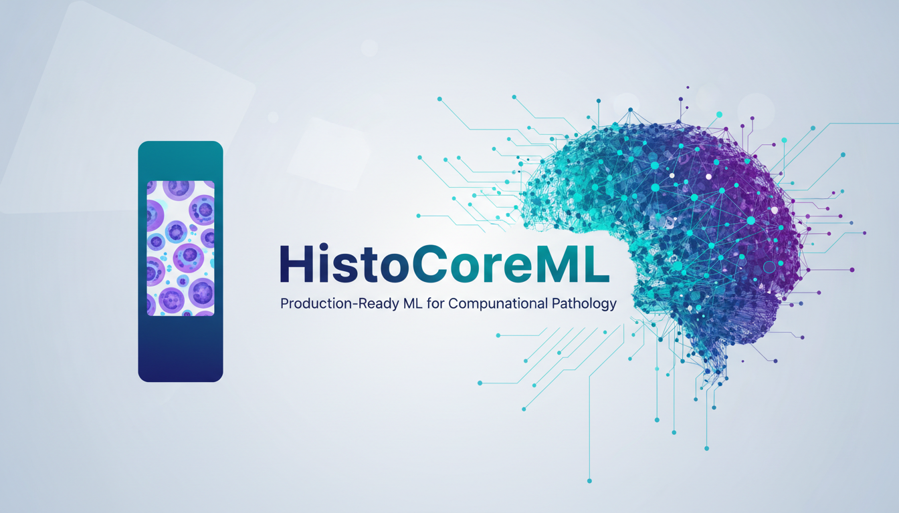
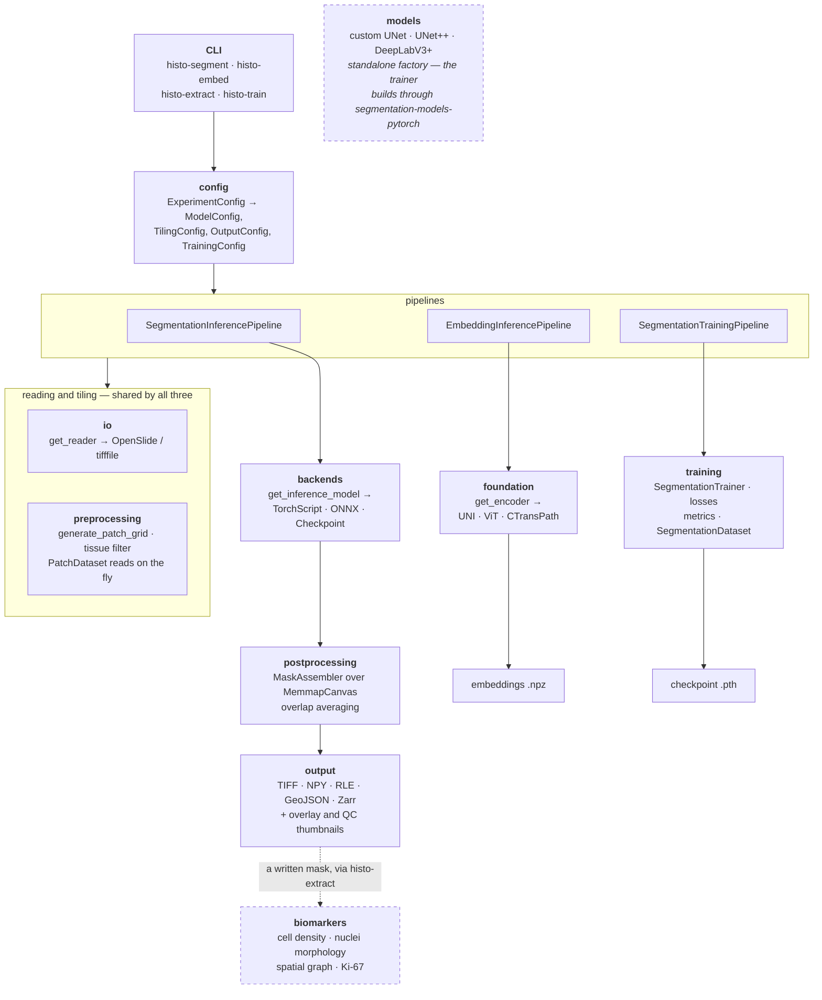
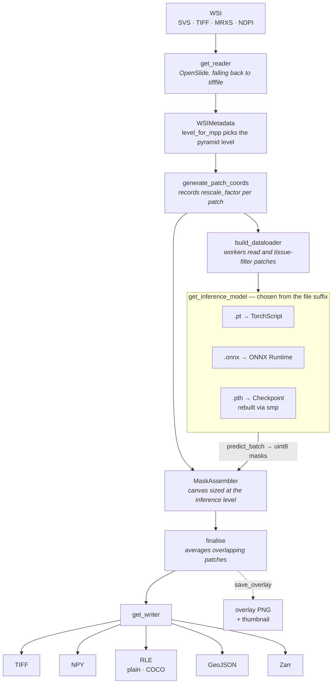
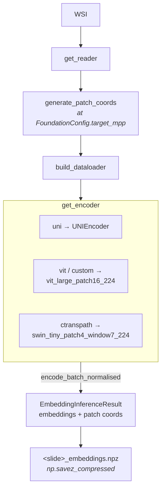
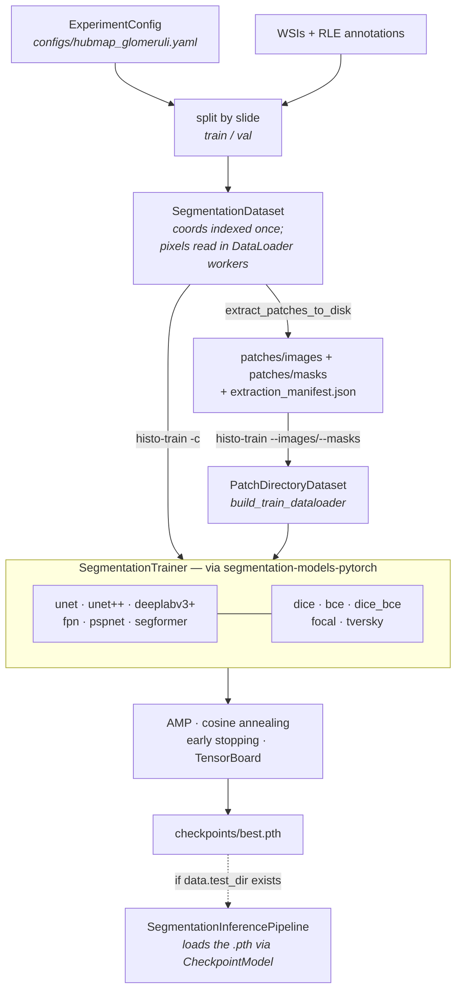

<div align="center">



# 🧬 HistoCoreML

**Production-ready ML framework for computational histology.**

[](https://www.python.org/downloads/)
[](https://pytorch.org/)
[](https://opensource.org/licenses/Apache-2.0)
[](https://github.com/MariaZork/histocore-ml/actions)
[](https://codecov.io/gh/MariaZork/histocore-ml)

</div>

HistoCoreML covers the full spectrum of computational pathology tasks in a single, coherent package:

Top-level packages are building blocks; `histocoreml.pipelines` is the only
layer that composes them. `histocoreml.training` and `histocoreml.pipelines.training`
share a name on purpose — one holds the trainer, losses and datasets, the other
orchestrates them. `backends` is named for what it is (how to run a model) rather
than for the task, so it does not collide with `pipelines.inference`.

| Module | What it does |
|--------|-------------|
| `histocoreml.io` | OpenSlide + TiffFile WSI readers, MPP metadata, multi-backend factory |
| `histocoreml.preprocessing` | Patch tiling, MPP enforcement, tissue filtering, Macenko H&E normalisation |
| `histocoreml.backends` | TorchScript, ONNX and training-checkpoint backends, chosen by file suffix |
| `histocoreml.postprocessing` | Memory-mapped mask assembly, overlap averaging |
| `histocoreml.output` | TIFF, NumPy, RLE (plain & COCO), Zarr, GeoJSON writers |
| `histocoreml.pipelines` | `SegmentationInferencePipeline`, `EmbeddingInferencePipeline`, `SegmentationTrainingPipeline`, `extract_patches_to_disk` |
| `histocoreml.foundation` | UNI, ViT, CTransPath encoders for feature extraction |
| `histocoreml.training` | `SegmentationDataset` (tiles slides on the fly), `PatchDirectoryDataset` (disk tiles), Dice/Focal/Tversky losses, `SegmentationTrainer` |
| `histocoreml.biomarkers` | Cell density, nuclei morphology, spatial graphs, Ki-67, H&E/DAB stain separation |
| `histocoreml.models` | UNet, UNet++, DeepLabV3+ — standalone factory; the trainer builds through segmentation-models-pytorch |
| `histocoreml.config` | `ExperimentConfig` (YAML) and the typed sub-configs it produces |
| `histocoreml.utils` | Logging setup, seeding, progress bars |

---

## Architecture Overview

Every box below is a real module. Configs are parsed once, pipelines compose the
shared building blocks, and results leave through the writers.



`biomarkers` and `models` are drawn detached on purpose: no pipeline imports
either. Biomarkers run from `histo-extract` over a mask that was already
written, and `models` is reached only through `get_model`.

### Segmentation Inference Flow



Predictions are made at `target_mpp` but the canvas sits at the pyramid level's
resolution, so `MaskAssembler` rescales each patch before writing it — without
that step, patches land at the wrong size whenever `rescale_factor != 1`.

### Foundation Model Embedding Flow



### Training Flow

Two ways in, both ending at the same trainer:



Extracting to disk costs a slow first pass and the storage, but pays off across
repeated experiments. Both routes go through the same dataset, so the patches
are identical either way.

---

## Setup

```bash
conda create -n histocoreml python=3.11
conda activate histocoreml
conda install -c conda-forge openslide

# Core (segmentation only)
pip install -e ".[openslide,dev]"

# Everything
pip install -e ".[all,dev]"
```

---

## Datasets

### HuBMAP Kidney Segmentation (Kaggle)

**Contest**: [HuBMAP: Hacking the Human Body](https://www.kaggle.com/competitions/hubmap-kidney-segmentation)

Download the dataset from Kaggle:

```bash
# Install Kaggle CLI
pip install kaggle

# Download dataset (requires Kaggle API credentials)
kaggle competitions download -c hubmap-kidney-segmentation

# Extract to data directory
unzip hubmap-kidney-segmentation.zip -d data/hubmap-kidney-segmentation
```

**Dataset Structure**:
```
data/hubmap-kidney-segmentation/
├── train/                          # Training images (.tiff)
│   ├── 2f6ecfcdf.tiff
│   ├── 0486052bb.tiff
│   └── ... (15 training slides)
├── test/                           # Test images
│   └── ... (5 test slides)
├── train.csv                       # RLE-encoded masks
└── HuBMAP-20-dataset_information.csv  # Slide metadata
```

**Note**: HuBMAP images are scanned at 20x magnification (~0.5 µm/px). The TIFF files don't contain MPP metadata, so the training script uses a default MPP value of 0.5.

---

### Other Kaggle Histology Datasets

| Contest | Year | Task | Images |
|---------|------|------|--------|
| [HuBMAP Kidney Segmentation](https://www.kaggle.com/competitions/hubmap-kidney-segmentation) | 2021 | Glomeruli segmentation | 20 WSIs |
| [PatchCamelyon](https://www.kaggle.com/datasets/basveeling/pcam) | 2018 | Metastasis detection | 327,680 patches |
| [BACH Breast Cancer](https://www.kaggle.com/datasets/simjeg/iciar-2018-challenge) | 2018 | Cancer classification | 400 microscopy |
| [CAMELYON16/17](https://camelyon17.grand-challenge.org/) | 2017 | Metastasis detection | 1,399 WSIs |
| [DigestPath2019](https://digestpath2019.grand-challenge.org/) | 2019 | Colonoscopy pathology | 1,120 images |
| [GlaS](https://warwick.ac.uk/fac/cross_fac/tia/data/glascontest) | 2015 | Gland segmentation | 165 images |
| [MoNuSeg](https://monuseg.grand-challenge.org/) | 2018 | Nuclei segmentation | 44 images |
| [CryoNuSeg](https://www.kaggle.com/datasets/ipateam/cryonuseg) | 2021 | Nuclei segmentation | 30 images |
| [LUAD Nuclei](https://www.kaggle.com/datasets/paultimothymooney/luad-nuclei-segmentation) | 2020 | Nuclei segmentation | 141 images |
| [PanNuke](https://warwick.ac.uk/fac/cross_fac/tia/data/pannuke) | 2019 | Nuclei instance segmentation | 7,981 patches |

---

## Configuration

Every file in `configs/` uses one schema, so the same document shape drives both
inference and training:

| Section | Purpose |
|---------|---------|
| `experiment` | Run name, output directory, seed |
| `data` | Tiling geometry, tissue filtering, dataloader settings, augmentation |
| `model` | Architecture, encoder, and `checkpoint` (the weights to run) |
| `training` | Epochs, optimiser, loss, early stopping — omit for inference-only configs |
| `inference` | Patch size, batch size, threshold, device, output format |
| `logging` | Log level and directory |

Configs split by **purpose**, not by format:

| Config | Drives | Notes |
|--------|--------|-------|
| `default.yaml` | `histo-segment` | TIFF output at 10x |
| `gpu.yaml` | `histo-segment` | Larger batches, more workers, `cuda:0` |
| `geojson.yaml` | `histo-segment` | Polygon contours for QuPath / ASAP |
| `rle_plain.yaml` | `histo-segment` | Compact RLE masks |
| `hubmap_glomeruli.yaml` | `histo-train` | Kidney glomeruli, WSI on-the-fly |
| `breast_tumor.yaml` | `histo-train` | Breast tumour, 3 classes |

The four inference configs name a `model.checkpoint`. The two training configs
deliberately do not — training produces it — so pointing `histo-segment` at one
reports `No model weights` until you supply a checkpoint.

Two conversion details worth knowing: `data.patch_overlap` is a **fraction** of
the patch size, while `TilingConfig.overlap` is in pixels; and the number of
output channels comes from `inference.num_classes`, not `data.num_classes`
(a training config counts annotation classes, while the network the trainer
builds emits a single foreground channel).

```python
from histocoreml.config import ExperimentConfig, SegmentationPipelineConfig

# Full experiment (training + inference settings)
cfg = ExperimentConfig.from_yaml("configs/hubmap_glomeruli.yaml")
trainer_cfg = cfg.training_config()

# Just the inference half — also what histo-segment builds internally
seg_cfg = SegmentationPipelineConfig.from_yaml("configs/default.yaml")
```

`SegmentationPipelineConfig.from_yaml` also accepts the older flat
`model`/`tiling`/`output` layout, so pre-existing configs keep working.

---

## CLI Usage

### Segmentation

```bash
# Basic run
histo-segment -c configs/default.yaml -i data/slide.svs --save-overlay

# GPU with RLE output
histo-segment -c configs/gpu.yaml -i data/*.svs --output-format rle --device cuda:0

# GeoJSON contours (compatible with QuPath / ASAP)
histo-segment -c configs/geojson.yaml -i data/slide.svs

# Macenko stain normalisation per patch (reduces scanner/staining batch effects)
histo-segment -c configs/default.yaml -i data/slide.svs --normalise
```

Any flag shown here overrides the config file. Inputs that do not exist are
reported on stderr and skipped; the run fails only if none of them exist.

`--normalise` maps to `inference.stain_normalise` in the config. It sits on the
model settings rather than the tiling settings because whether patches need
stain normalisation is fixed by how the model was trained — changing overlap or
tissue thresholds must not change it.

### Foundation Model Embeddings

```bash
histo-embed --model uni --model-path weights/uni.pth \
            -i data/*.svs -o embeddings/ --device cuda:0
```

### Biomarker Extraction

```bash
histo-extract -i data/slide.svs \
              --mask outputs/slide_mask.npy \
              --tasks cell_density nuclei_morphology spatial_graph ki67_index
```

### Training

```bash
# From an experiment config — tiles whole-slide images on the fly
histo-train -c configs/hubmap_glomeruli.yaml
histo-train -c configs/hubmap_glomeruli.yaml --debug          # smoke test on training.debug_samples patches
histo-train -c configs/hubmap_glomeruli.yaml --resume outputs/hubmap/checkpoints/best.pth

# From directories of pre-extracted tiles
histo-train --images data/images --masks data/masks \
            --val-images data/val_images --val-masks data/val_masks \
            --arch unet --encoder resnet50 --loss dice_bce \
            --epochs 100 --lr 1e-4
```

### End-to-End Training Pipeline

For complete workflows (tiling → training → inference), use the Python API. The
whole run is described by one experiment config:

```python
from histocoreml.config import ExperimentConfig
from histocoreml.pipelines import SegmentationTrainingPipeline

cfg = ExperimentConfig.from_yaml("configs/hubmap_glomeruli.yaml")

pipeline = SegmentationTrainingPipeline(cfg, debug=False)
result = pipeline.run()  # Tiles slides on the fly → trains → validates → infers

print(result.best_metric, result.checkpoint_path)
```

`run(train=False)` skips straight to inference from an existing checkpoint, and
`run(infer=False)` stops after training. Failures are collected in
`result.errors` rather than raised.

### Using Your Own Data

`SegmentationDataset` tiles any set of slides; nothing in it is specific to one
dataset or organ. Ground truth arrives through a `MaskProvider`, so supporting a
new annotation format means implementing two methods rather than touching the
dataset:

```python
from histocoreml.config import TilingConfig
from histocoreml.training import MaskProvider, RLEMaskProvider, SegmentationDataset

# Built in: run-length encoded masks in a two-column CSV
provider = RLEMaskProvider.from_csv(Path("train.csv"))

dataset = SegmentationDataset(
    slide_dir=Path("data/slides"),
    mask_provider=provider,
    tiling_cfg=TilingConfig(overlap=256, tissue_threshold=0.05),
    patch_size=512,
    target_mpp=0.5,          # slides without MPP metadata fall back to level 0
    slide_ids=train_ids,     # how a train/val split is applied
)
```

For a different annotation source — GeoJSON polygons, PNG masks, a database —
subclass `MaskProvider`:

```python
import numpy as np
from histocoreml.training import MaskProvider

class PngMaskProvider(MaskProvider):
    def __init__(self, mask_dir: Path):
        self._paths = {p.stem: p for p in mask_dir.glob("*.png")}

    def slide_ids(self) -> list[str]:
        return sorted(self._paths)

    def get_mask(self, slide_id: str, shape: tuple[int, int]) -> np.ndarray:
        from PIL import Image
        mask = np.array(Image.open(self._paths[slide_id]).convert("L"))
        return (mask > 127).astype(np.uint8)
```

The dataset handles tiling, the tissue filter, MPP rescaling and cropping the
mask to each patch, so a provider only has to return a full-resolution mask.

### Pre-extracting Patches

The pipeline above re-reads slides every epoch, which is the right trade when a
dataset is used once. To run many experiments over the same data, tile it once
and train from the PNG pairs instead:

```python
from pathlib import Path

from histocoreml.config import TilingConfig
from histocoreml.pipelines import extract_patches_to_disk
from histocoreml.training import RLEMaskProvider, build_train_dataloader

stats = extract_patches_to_disk(
    slide_dir=Path("data/hubmap-kidney-segmentation/train"),
    mask_provider=RLEMaskProvider.from_csv(Path("data/.../train.csv")),
    output_dir=Path("patches"),
    tiling_cfg=TilingConfig(overlap=0, tissue_threshold=0.05),
    patch_size=512,
    target_mpp=0.5,
    skip_empty_masks=False,  # True biases class balance — see the docstring
)

loader = build_train_dataloader(stats.images_dir, stats.masks_dir)
```

This writes `patches/images/`, `patches/masks/` and an
`extraction_manifest.json` recording the settings used. The layout is exactly
what `histo-train --images/--masks` consumes:

```bash
histo-train --images patches/images --masks patches/masks \
            --arch unet++ --encoder efficientnet-b4 --epochs 100
```

Tiling, tissue filtering and mask alignment all go through the same dataset the
on-the-fly pipeline uses, so extracted patches are byte-identical to what
in-memory training would have fed the model.

### HuBMAP Kidney Segmentation (Kaggle)

The `scripts/train_segmentation.py` script provides on-the-fly patch reading for HuBMAP datasets:

```bash
# Full training pipeline
python scripts/train_segmentation.py \
    --data-dir ./data/hubmap-kidney-segmentation \
    --output-dir ./outputs/hubmap \
    --architecture unet++ \
    --encoder efficientnet-b4 \
    --epochs 100

# Debug mode (fast verification)
python scripts/train_segmentation.py --debug

# Inference with trained model
python scripts/train_segmentation.py \
    --checkpoint ./outputs/hubmap/checkpoints/best.pth \
    --inference-only
```

This script uses **on-the-fly patch reading**: instead of saving thousands of patches to disk, it reads regions directly from WSI during training using patch coordinates.

---

## Python API

### Segmentation Inference

```python
from histocoreml.config import SegmentationPipelineConfig
from histocoreml.pipelines import SegmentationInferencePipeline
from pathlib import Path

cfg      = SegmentationPipelineConfig.from_yaml("configs/default.yaml")
pipeline = SegmentationInferencePipeline(cfg)
results  = pipeline.run([Path("slide.svs")])

for r in results:
    if r.success:
        print(f"Mask: {r.write_result.path}  ({r.elapsed_seconds:.1f}s)")
```

### Foundation Model Embeddings

```python
from histocoreml.config import FoundationConfig
from histocoreml.pipelines import create_embedding_pipeline
from pathlib import Path

cfg = FoundationConfig(
    model_name="uni",
    model_path=Path("uni.pth"),
    embedding_dim=1024,
    target_mpp=0.5,
    device="cuda"
)
pipeline = create_embedding_pipeline(cfg)
results = pipeline.run([Path("slide.svs")], output_dir=Path("embeddings"))
# → embeddings/slide_embeddings.npz  (N_patches × 1024)
```

### Biomarker Extraction

```python
import numpy as np
from histocoreml.config import BiomarkerConfig
from histocoreml.biomarkers import BiomarkerExtractor
from pathlib import Path

mask      = np.load("outputs/slide_mask.npy")
cfg       = BiomarkerConfig(tasks=["cell_density", "nuclei_morphology",
                                    "spatial_graph", "tumor_stroma_ratio"])
extractor = BiomarkerExtractor(cfg)
report    = extractor.run(Path("slide.svs"), mask=mask)
report.save(Path("biomarkers/slide.json"))
print(report.features)
```

### Training

```python
from histocoreml.config import TrainingConfig
from histocoreml.training import SegmentationTrainer, build_train_dataloader
from pathlib import Path

cfg = TrainingConfig(
    architecture="unet",
    encoder="resnet50",
    loss="dice_bce",
    epochs=100
)
train_loader = build_train_dataloader(Path("data/images"), Path("data/masks"))
val_loader   = build_train_dataloader(Path("data/val_images"), Path("data/val_masks"),
                                       shuffle=False)
trainer = SegmentationTrainer(cfg)
history = trainer.fit(train_loader, val_loader)
```

### Stain Normalisation (standalone)

```python
from histocoreml.preprocessing.patch_utils import macenko_normalise
import numpy as np
from PIL import Image

patch      = np.array(Image.open("patch.png").convert("RGB"))
normalised = macenko_normalise(patch)
```

---

## Output Formats

| Format | Extension | Notes |
|--------|-----------|-------|
| TIFF | `_mask.tiff` | Tiled GeoTIFF with MPP resolution tag — compatible with QuPath, ImageJ |
| NumPy | `_mask.npy` | Fast; ideal for downstream Python analysis |
| Plain RLE | `_mask.json` | Row-major (value, count) pairs; ~20× compression |
| COCO RLE | `_mask.json` | Column-major; compatible with pycocotools |
| Zarr | `_mask.zarr` | Chunked array; supports S3/GCS cloud backends |
| GeoJSON | `_mask.geojson` | Polygon contours in physical (µm) coordinates |

---

## Running Tests

```bash
# All unit tests (no GPU or OpenSlide required)
pytest tests/unit

# Verbose
pytest -v

# Skip slow tests
pytest -m "not slow"

# With coverage
pytest --cov=histocoreml --cov-report=term-missing
```

---


[def]: assets/banner.png
